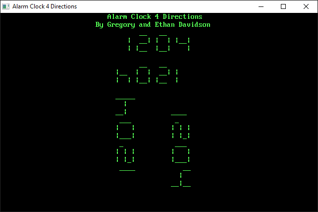

# Alarm Clock 4 Directions ⏰

> by GDDMAD and Ethan Davidson

## Demo 🤩

## Installation 💽

[Download](https://github.com/EthanThatOneKid/alarm-clock/archive/master.zip) from GitHub or use Git in your terminal with `git clone https://github.com/EthanThatOneKid/alarm-clock`.

## Usage 💪

Run the executable `Alarm Clock 4 directions.exe` and a new window should open that displays the current time in four directions using ascii characters.
To set the alarm to beep at a certain time, instead run the executable `Set Alarm Clock.exe` and enter it (HHMM in military time).
Furthermore, the reorganization of any files in the file may result in the program breaking. Because of this, it is suggested that you do not move any files or folders in the directory.

## Todo ✅

* [ ] Add the alarm setting function to the main alarm clock program by using keypress to activate the prompt.

---

Created with 💤 by GDDMAD and EthanThatOneKid